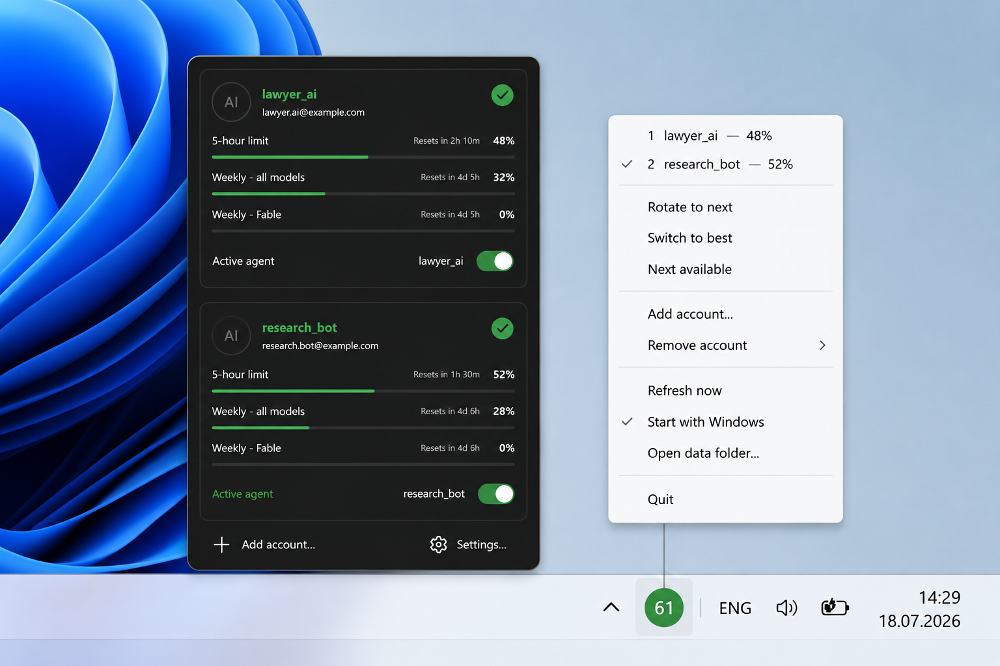

# chuhAIster

A tiny Windows tray app that holds several **Claude Code** accounts, shows each
one's usage limits, and switches between them in one click.

Named after the *chuhaister* — a friendly forest spirit from Carpathian
folklore — with the **AI** hiding inside.



## What it does

- Lives in the system tray and shows the active account's usage on the icon.
- **Hover / click** the icon → a panel with every account: 5-hour, weekly and
  per-model limits, with reset countdowns.
- **Switch** accounts from the panel toggle or the menu (rotate, least-used,
  next available).
- No Python, no runtime — two small native executables, ~24 MB of RAM.

## Install

Download **chuhaister-setup-x.y.z.exe** from
[Releases](https://github.com/teraxis/chuhaister/releases) and run it.

- Installs per-user (no administrator prompt).
- Optional "start with Windows".
- Windows may show a SmartScreen warning because the installer isn't
  code-signed — choose *More info → Run anyway*.

## Adding an account

Right-click the tray icon → **Add account…**

Your browser opens Claude's sign-in page. Press **Authorize** and you're done —
the account appears in the tray automatically, nothing to copy or paste. To add
a different account, click **Switch account** on the consent screen first.

Credentials are stored encrypted with Windows DPAPI (current-user scope) in
`%USERPROFILE%\.cswap`.

## Where the switch takes effect

chuhAIster changes the credentials that **Claude Code** uses.

- ✅ Works for the **Claude Code CLI** and **Antigravity** (they read Claude
  Code's credentials).
- ❌ Does **not** switch the account in the **official Claude desktop app** — it
  keeps its own separate login.

After switching, restart your Claude Code session to pick up the new account.

## Supported platforms

- **Windows 10 / 11 (x64).**
- The shared C++ core is portable, but the UI, credential storage (DPAPI) and
  networking (WinHTTP) layers are Windows-only for now.

## Build from source

Needs [Zig](https://ziglang.org) as the C++ toolchain and, for the installer,
[Inno Setup 6](https://jrsoftware.org/isdl.php). Adjust the tool paths at the
top of `build.ps1`, then:

```powershell
.\build.ps1              # both executables
.\build.ps1 installer    # dist\chuhaister-setup-x.y.z.exe
```

## Credits

This is a **C++ fork of [claude-swap](https://github.com/realiti4/claude-swap)**
by [realiti4](https://github.com/realiti4). Thank you for the original project
and the account-switching design this build is based on — chuhAIster reimplements
the everyday path natively and adds the browser sign-in wizard.

## Disclaimer & risk notes

Use this at your own discretion, and read
[Claude's terms](https://www.anthropic.com/legal/consumer-terms) yourself before
relying on it. This is not legal advice. A short, honest read of the terms:

- **Several accounts that are all yours** — the terms contain no rule against
  holding more than one account.
- **Someone else's account** — storing or using another person's credentials is
  account sharing, which the terms prohibit. Only use your own accounts.
- **Switching when one account runs out** — the text doesn't forbid it, but the
  clause against "bypassing any of our protective measures" is broad, and usage
  limits are arguably such a measure. Manually switching between your own paid
  subscriptions reads as ordinary use; buying accounts *specifically* to pool
  and drain their limits automatically is where that clause bites. chuhAIster
  only switches when you tell it to — there is no automatic limit-evasion.

You are responsible for how you use it. The author and contributors provide it
"as is", with no warranty.

## License

[MIT](LICENSE) © Bilyk Ihor. Portions derived from claude-swap (MIT).
